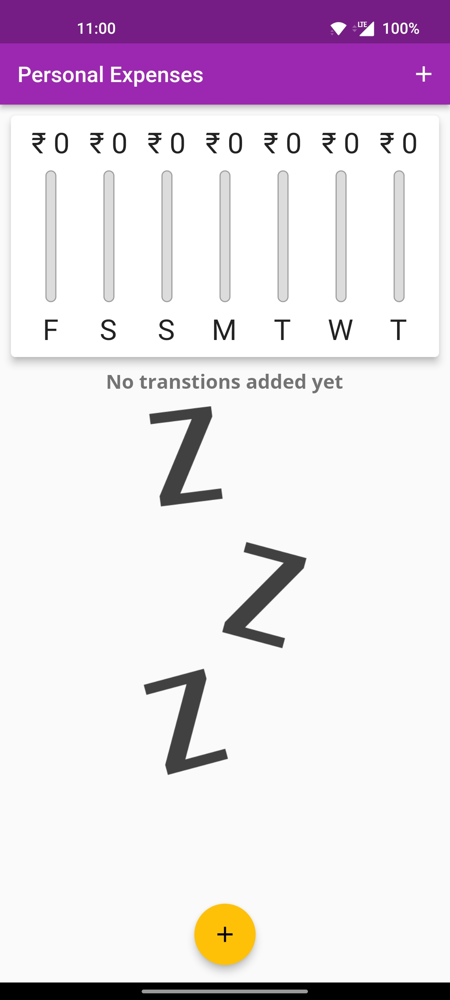
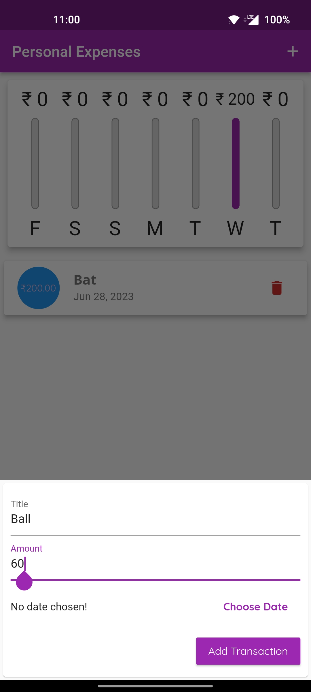
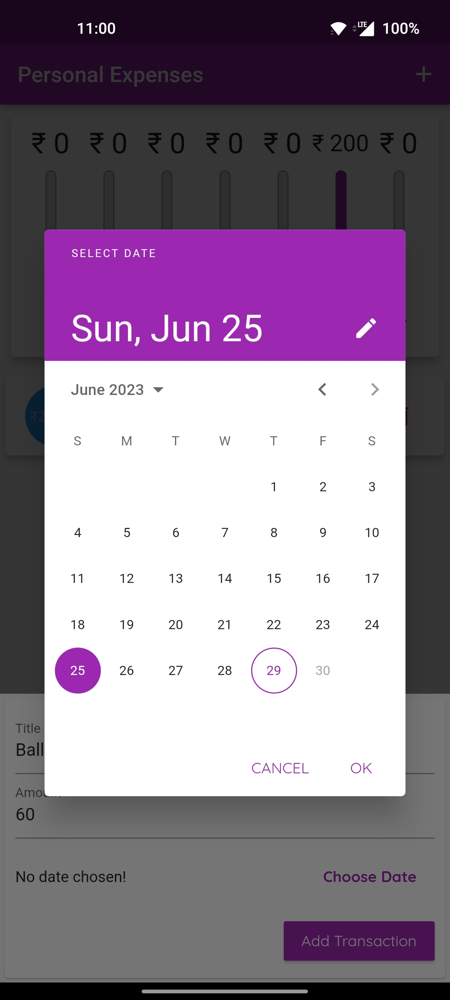
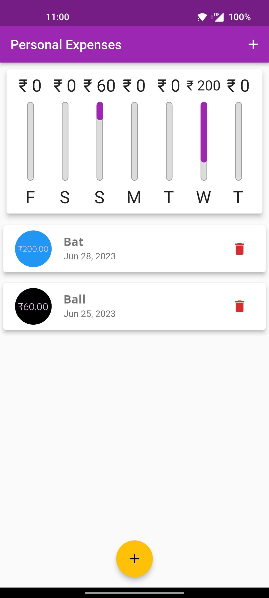

# Personal Expenses

- The Personal Expenses App is a mobile application developed using Flutter that allows users to track their personal expenses.
- It provides an intuitive and user-friendly interface to manage and monitor expenses on the go.
- [📦.apk](https://github.com/Akshit1903/PersonalExpenses/blob/main/app-release.apk)
- [📽️YouTube](https://youtu.be/bgweoBbArtI)



## Features

- Expense Tracking: Easily track personal expenses.
- Transaction History: View a detailed transaction history for better expense management.
- Expense Visualization: Visualize expenses through charts and graphs for better insights.

## Technologies Used

- Flutter: The UI toolkit used for developing cross-platform applications.
- Dart: The programming language used to write the application logic.

## Installation

1. Clone the repository:

   ```shell
   git clone https://github.com/Akshit1903/PersonalExpenses
   ```

2. Navigate to the project directory:
   ```shell
   cd PersonalExpenses
   ```
3. Install dependencies:
   ```shell
   flutter pub get
   ```
4. Run the application:
   ```shell
   flutter run
   ```

## Usage

- Launch the Personal Expenses App on your mobile device.
- Add your personal expenses by entering the amount, selecting the title, and adding a description.
- View your expense history and track your spending habits.
- Visualize your expenses through chart to gain insights into your spending patterns.
